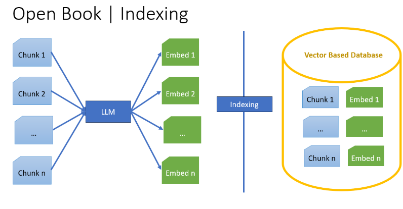
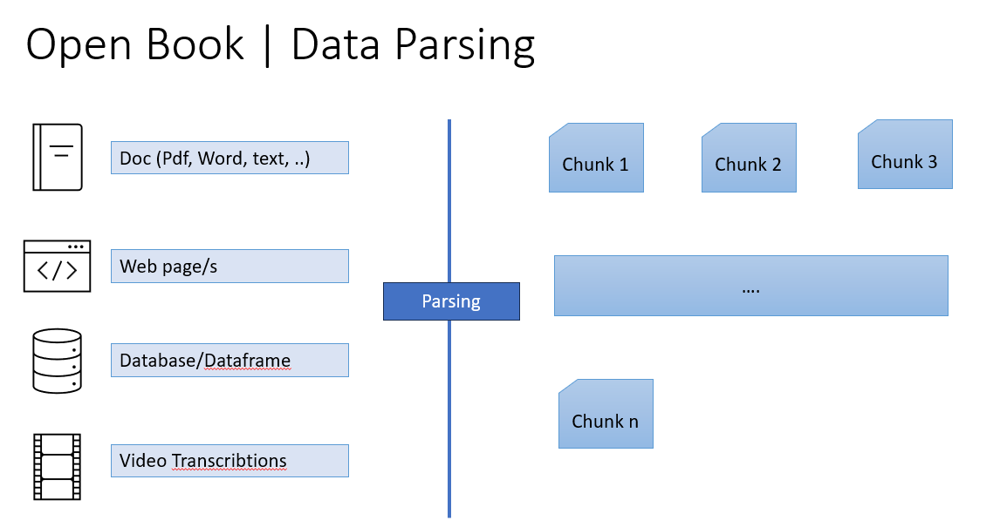
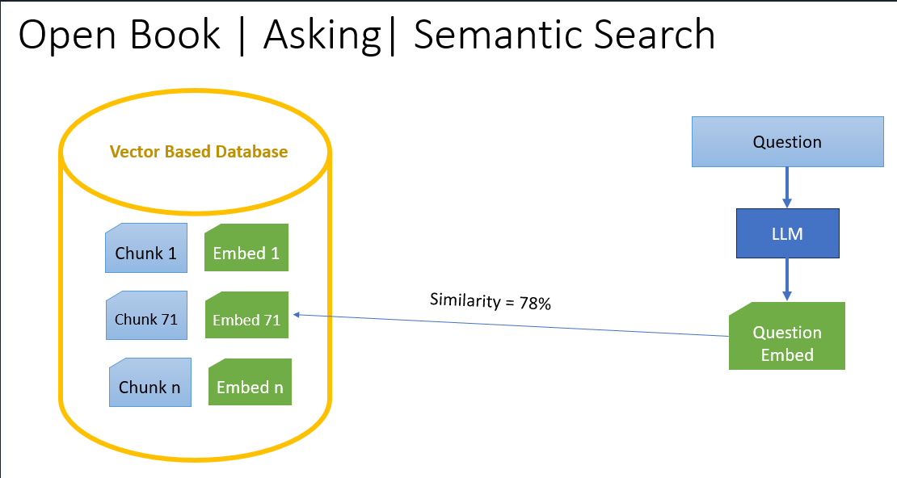
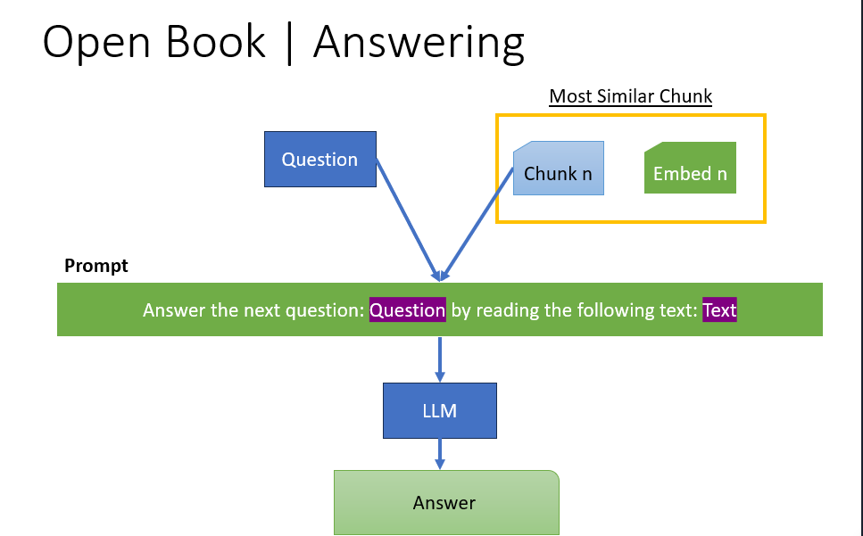

# Rag_Project

This is a minimal implementation of the RAG model for question answering.

## Requirements

- Python 3.12.2 or later

## Installation

### étapes pour lancer FastAPI avec Uvicorn sans Conda
1-Créer l'environnement virtuel :

```bash
$ python3 -m venv venv
```
2-Activer l'environnement virtuel :
```bash
$ source venv/bin/activate
```
3-Installer les dépendances (FastAPI et Uvicorn) :
```bash
$ pip install fastapi uvicorn
```
4-Lancer l'application FastAPI :
```bash
$ uvicorn main:app --reload
```

### Install the required packages

```bash
$ pip install -r requirements.txt
```

### Setup the environment variables

```bash
$ cp .env.examples .env
```

Set your environment variables in the `.env` file. Like `OPENAI_API_KEY` value.

### Install Ollama (Optional)

1) Install Ollama from [here](https://github.com/ollama/ollama/tree/main#ollama)
2) Pull one of the models from [here](https://github.com/ollama/ollama/tree/main#model-library)

```bash
$ ollama pull dolphin-phi
```

3) (**Optional**) set the `OLLAMA_HOST` in your operating system to be `0.0.0.0`
4) Run the Ollama server 

```bash

$ ollama serve

```

5) (**Optional**) Explore the APIs [Docs](https://github.com/ollama/ollama/blob/main/docs/api.md)


## Run the FastAPI server

```bash
$ uvicorn main:app --reload --host 0.0.0.0 --port 5000
```


## APIs Stape

### 1) Upload a document

```bash
curl --location --request POST 'http://localhost:5000/api/v1/upload/1' \
--form 'file=@"/C:/Users/Home/Desktop/wiki.txt"'
```

### 2) Process the document

This step includes:
1) Extracting the text from the document
   
2) Chunking the text into documents



3) Indexing the documents into LanceDB
   


```bash
curl --location --request POST 'http://localhost:5000/api/v1/process/1' \
--header 'Content-Type: application/json' \
--data '{
    "file_name": "1_NYAUD71QDR_wiki.txt",
    "chunk_size": 200,
    "overlab_size": 50,
    "reset": 1,
    "llm_type": "huggingface"
}'
```

### 3) Search for similar documents

This step includes:
1) Convert query text to embeddings
   
2) Search for similar documents using the embeddings / or / keywords



```bash
curl --location --request POST 'http://localhost:5000/api/v1/search/1' \
--header 'Content-Type: application/json' \
--data '{
    "query": "من مخترع الة التصوير السينمائي؟",
    "llm_type": "huggingface",
    "mode": "hybrid",
    "file_name": "1_NYAUD71QDR_wiki.txt",
    "hybrid_scale": 0.7
}'
```

### 4) Get the answer
This step includes:
1) Convert query text to embeddings
   
2) Search for similar documents using the embeddings / or / keywords
   
3) Create a prompt including the query and the similar documents
   
4) Pass the prompt to the LLM model to get the answer
   


```bash
curl --location --request POST 'http://localhost:5000/api/v1/answer/1' \
--header 'Content-Type: application/json' \
--data '{
    "query": "من مخترع الة التصوير السينمائي؟",
    "llm_type": "huggingface", 
    "mode": "hybrid", 
    "llm_prompt_type": "openai", 
    "return_prompt": true
}'
```